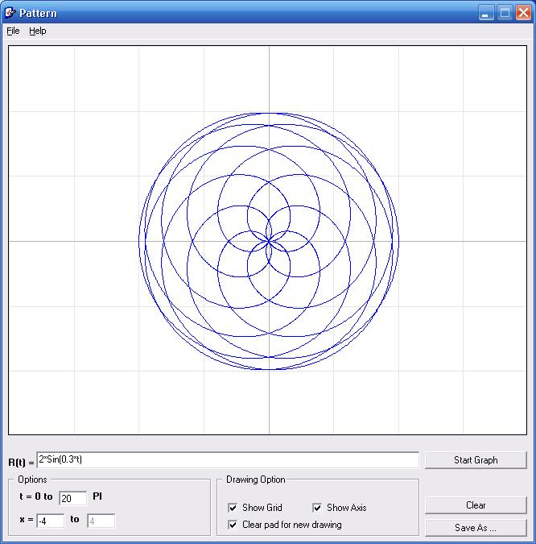



## Polar Plotter 1\.0

### Description

This program graph polar functions.
 
### More Info
 

             |
---                |---
**Submitted On**   |2006-11-10 13:39:40
**By**             |[Mehdi Eghbalahmadi](https://github.com/Planet-Source-Code/PSCIndex/blob/master/ByAuthor/mehdi-eghbalahmadi.md)
**Level**          |Advanced
**User Rating**    |5.0 (10 globes from 2 users)
**Compatibility**  |VB 6\.0
**Category**       |[Math/ Dates](https://github.com/Planet-Source-Code/PSCIndex/blob/master/ByCategory/math-dates__1-37.md)
**World**          |[Visual Basic](https://github.com/Planet-Source-Code/PSCIndex/blob/master/ByWorld/visual-basic.md)
**Archive File**   |[Polar\_Plot2084539242007\.zip](https://github.com/Planet-Source-Code/mehdi-eghbalahmadi-polar-plotter-1-0__1-69389/archive/master.zip)

